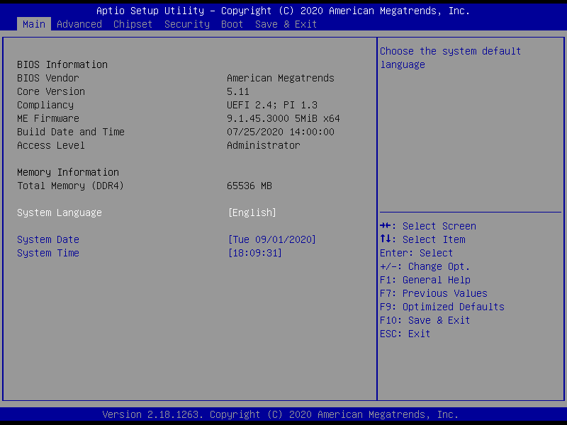
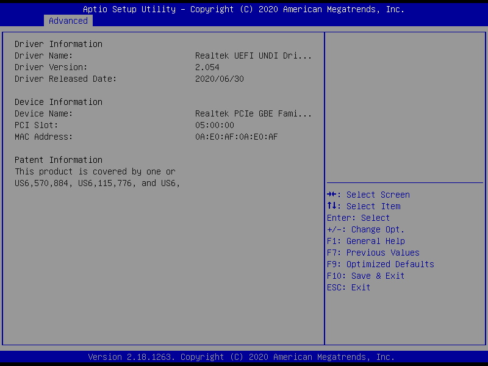
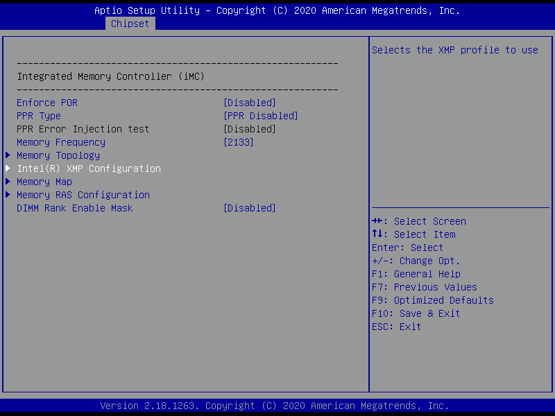
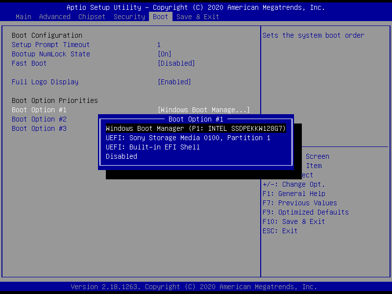
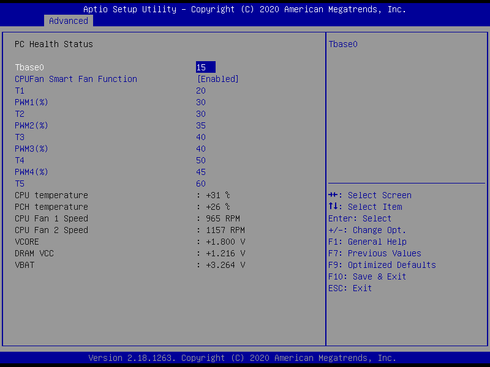
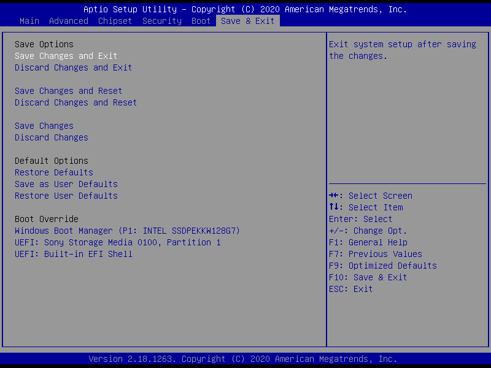

# HUANANZHI X99-TF GAMING
## BY99RD25 BIOS for HUANANZHI X99-TF GAMING Motherboard 08/25/2020 (Republic of Belarus Edition)

  Builder: iEngineer

  Manufacturer Bug Fixed, Latest updates, set FSB 100MHz

  Update:
1) ME Firmware (latest) version 9.1.45.3000 (5MiB).
2) EFI/OROM for RSTe SATA(Port 0-3)/sSATA(Port 4-7) firmware up to 5.5.5.1005 ((latest) Full I/O speed).
3) CPU microcode (latest).
4) AMI NVMe firmware (latest).
5) LAN Boot ROM.
6) EFI Realtek UNDI PCIe GbE Family Controller Driver (2.054, 06/30/2020)
7) DMI Data.

  Deleted:
1) All trash (Unrelated to Huananzhi X99-TF).

  Added:
1) EFI Shell version 2.40.

  Looked:
MBEx, Cipher Transport Layer TLS (CVE-2017-5689 & CVE-2018-3616), PTT, NFC, RPAT, AMT.

  Changes:
1) Enable DUAL/QUAD SPI for Winbond 25Q128FVSG & 25Q128JVSQ.
2) Changes Master Acces from Debug/Manufacturing to Production.
3) Increased BBBS up to 1MiB.
4) WCOD ID 0x0082 TAYLOR.
5) Permanently disabled Intel AMT.
6) Permanently disabled Intel ME Network Service.
7) Hidden BIOS items that do not control.

  How to update Firmware:
1) Burn the Firmware to programmer device. (e.g. EZP-2019)
2) Clear CMOS.
3) After restart go to the BIOS setting & use 'Restore Default' / 'F10' / 'Enter'
4) Configure RAM timings & enjoy.

Brief:

